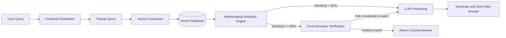
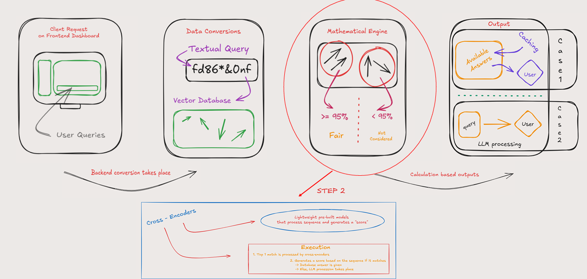

# 🧠 SemanticCache-LLM

> **Stop re-generating the same answers. Start caching with deep intent.**
>
> Built by **Vadanta Kumar Chauhaan** 

> **Confidential project.** The contents of this repository are for authorized use only.

## 🚀 Core Idea

LLM APIs are expensive and slow. Traditional lexical caching compares the text of a new request with previous requests, so it misses questions that have the same meaning but use different words.

**SemanticCache-LLM** converts each query into a semantic vector and checks whether a sufficiently similar answer already exists. When the cached answer passes both semantic verification stages, the system returns it without sending another request to the LLM.

## 🏗️ System Workflow

The request travels through the following pipeline:

1. A user submits a query through the frontend dashboard.
2. The backend converts the text query into a vector representation.
3. The vector database retrieves semantically similar cached queries.
4. The mathematical engine compares the query vectors and applies the similarity threshold.
5. Candidates with a similarity score of at least **95%** are considered fair matches.
6. A cross-encoder performs a second, deeper verification on the best candidate.
7. A verified match returns the cached answer. Otherwise, the query is sent for fresh LLM processing.

## 🔍 Two-Stage Semantic Matching

### Stage 1: Vector Similarity

The textual query is encoded into a vector and compared against vectors in the cache. This stage is optimized for fast candidate retrieval. The mathematical engine uses the similarity score to filter out unrelated queries before deeper processing.

### Stage 2: Cross-Encoder Verification

The top candidate is passed to a lightweight pretrained cross-encoder. It processes the query pair together and produces a relevance score, allowing the system to verify whether the cached response genuinely matches the user’s intent.

## 🛠️ Tech Stack

| Layer | Technology or responsibility |
| --- | --- |
| Frontend | Dashboard for submitting user queries and displaying cached or generated answers |
| Backend | Python service coordinating query processing and cache decisions |
| Text embedding | Transformer-based bi-encoder from `sentence-transformers` |
| Vector storage | Vector database for storing query embeddings and cached responses |
| Similarity engine | Mathematical vector comparison with a 95% match threshold |
| Verification | Lightweight pretrained cross-encoder for pairwise relevance scoring |
| LLM layer | Fresh answer generation when no verified cache match exists |
| Dataset | `Knowledge/chatbot_arena_dataset.csv` for experimentation and evaluation |
| Model runtime | PyTorch and Transformer model tooling |

## 📁 Knowledge Assets

- [`Core-Idea.pdf`](Knowledge/Core-Idea.pdf): Core architecture and matching concept.
- [`WorkFlow.png`](Knowledge/WorkFlow.png): Visual request workflow.
- [`chatbot_arena_dataset.csv`](Knowledge/chatbot_arena_dataset.csv): Dataset available for experimentation and evaluation.